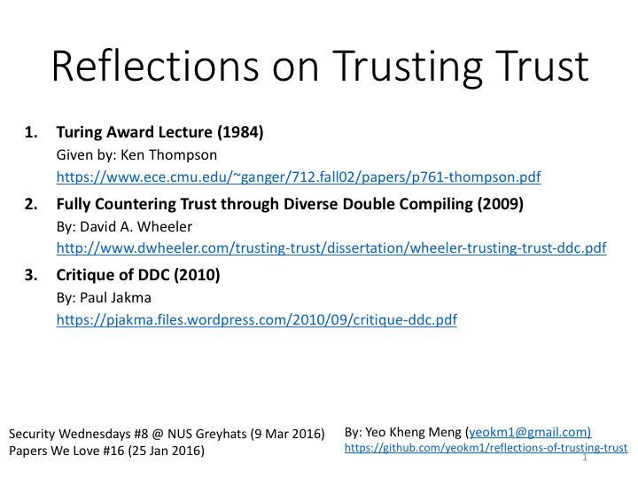

# reflections-on-trusting-trust
A talk about the Turing award lecture "Reflections on Trusting Trust" originally given by Ken Thompson.

Demo C programs are in the codes directory. My slides are available on slideshare in the picture link below.

[](http://www.slideshare.net/yeokm1/reflections-on-trusting-trust-57427452)

There are some SHA-256 checksum values used in my presentation. These values are dependent on the binaries generated by a specific compiler version which may change over time. The following shows the compiler version running on my Mac OS X El Capitan.

```bash
$ gcc -v
Configured with: --prefix=/Applications/Xcode.app/Contents/Developer/usr --with-gxx-include-dir=/usr/include/c++/4.2.1
Apple LLVM version 7.0.2 (clang-700.1.81)
Target: x86_64-apple-darwin15.2.0
Thread model: posix
```


References
====
1. [Reflections on Trusting Trust paper source](https://www.ece.cmu.edu/~ganger/712.fall02/papers/p761-thompson.pdf)
2. [Fully Countering Trust through Diverse Double Compiling paper source](http://www.dwheeler.com/trusting-trust/dissertation/wheeler-trusting-trust-ddc.pdf)
3. [Critique of DDC paper source](https://pjakma.files.wordpress.com/2010/09/critique-ddc.pdf)
